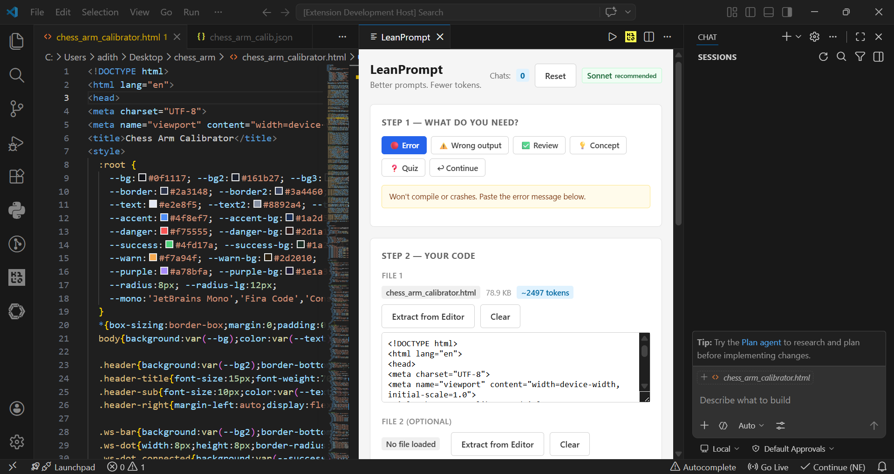
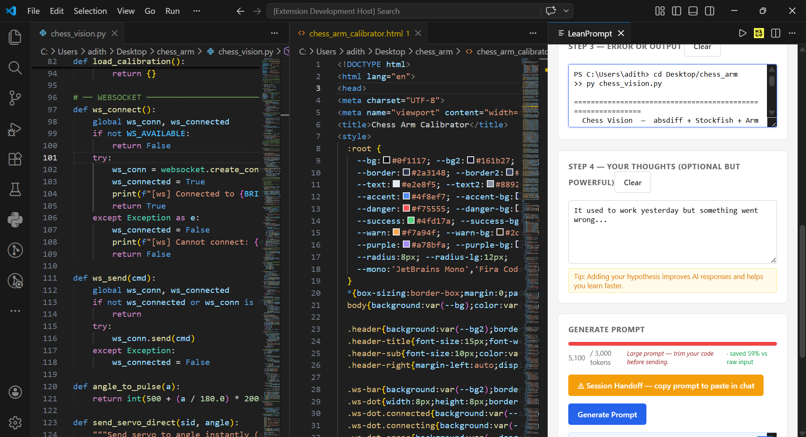
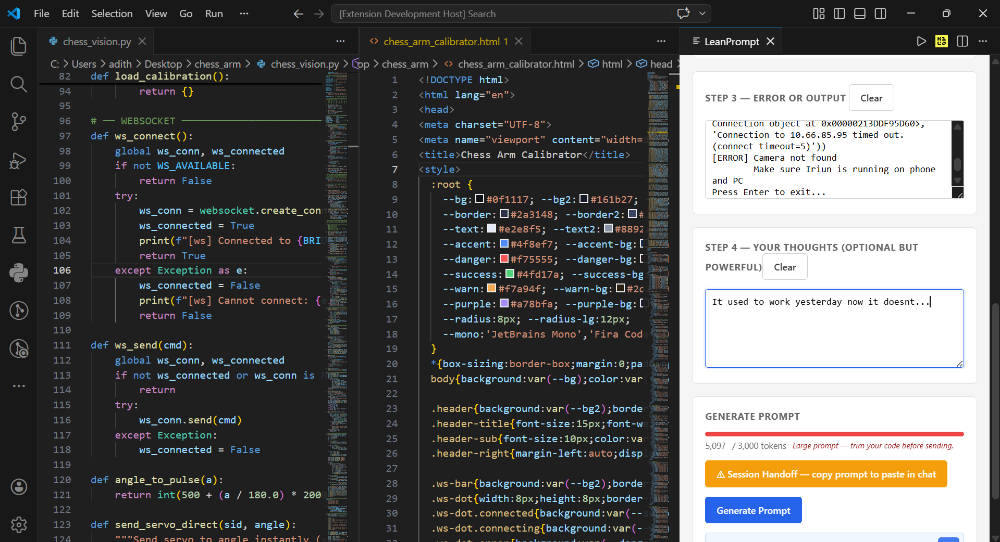

# LeanPrompt

'[Install from VS Code Marketplace](https://marketplace.visualstudio.com/items?itemName=stillbuild.leanprompt)'

**Write better AI prompts from inside VS Code. Stop burning tokens.**

`Ctrl+Shift+K` → structured prompt → copy → paste. Done.

---


## 🧪 Example (Real Debug Case)

### Input

Code:
async def fetch_user_data(user_id):
    response = await api.get(f"/users/{user_id}")
    return response.data.profile.name

Error:
AttributeError: 'NoneType' object has no attribute 'profile'

---

### Generated Prompt

Error: AttributeError: 'NoneType' object has no attribute 'profile'

My thinking: API might sometimes return null data.

Explain:
- What exactly is None here
- Which line causes the crash
- Why it happens in this async/API context
- Minimal fix only (no rewrite)

---

### Why this is better

- Targets the exact failure instead of dumping full code
- Keeps token usage low
- Produces precise, minimal fixes from AI

---

## Why

When you paste raw code into Claude or ChatGPT, you get raw answers. Long chats hit token limits. Vague prompts waste context. You start over and explain everything again.

LeanPrompt fixes the workflow — not the AI.

---

## How It Works

### Step 1 — Pick what you need

| Mode | When to use |
|------|-------------|
| 🔴 Error | Code won't compile or crashes |
| ⚠️ Wrong output | Runs, but gives the wrong result |
| ✅ Review | Works — want a quick confirm + one tip |
| 💡 Concept | Type your understanding, AI flags gaps only |
| ❓ Quiz | One question at a time, tests your understanding |
| ↩ Continue | Mid-chat — skips re-sending context to save tokens |

## Screenshots



### Step 2 — Extract your code

Click **Extract from Editor** — pulls your active file directly. Supports 2 files simultaneously. Large files are truncated at logical boundaries (not mid-function), with a token estimate shown per file.

### Step 3 — Add error or output

Paste your error message or wrong output. LeanPrompt includes it in the prompt with the right framing for the mode you picked.

### Step 4 — Add your hypothesis (optional)

What do you think is going wrong? Even one sentence here makes AI responses noticeably better.

### Generate → Copy → Paste

Hit **Generate Prompt**. Copy it. Paste into Claude, ChatGPT, or Gemini.

---

## Features

**Token Meter** — live estimate as you build, color-coded green → yellow → red. Warns before you hit limits and suggests what to trim.

**Follow-up detection** — if you're continuing the same problem, LeanPrompt generates a shorter prompt that skips repeated context.

**Session Handoff** — when a chat gets too long, generate a compact summary (under 200 words) to paste into a fresh chat. Resets your counter automatically.



**Chat counter** — tracks how many prompts you've sent this session. Turns yellow at 15, red at 20, with a reminder to hand off.

**Model toggle** — click the badge to switch between Sonnet (fast, efficient, recommended) and Opus (higher quality, slower). Opus warning is shown.

**Open AI directly** — buttons to open Claude, ChatGPT, or Gemini in your browser without leaving VS Code.

**Session persistence** — chat count and prompt number survive VS Code restarts.

---

## Installation

### VS Code Marketplace
Search **LeanPrompt** in the Extensions panel (`Ctrl+Shift+X`).

### Manual
```bash
git clone https://github.com/Adi-gyt/leanprompt
cd leanprompt
npm install
npm run compile
npx vsce package
```
Extensions → `···` → **Install from VSIX** → select the `.vsix` file.

---

## Keyboard Shortcut

| Shortcut | Action |
|----------|--------|
| `Ctrl+Shift+K` / `Cmd+Shift+K` | Open LeanPrompt |

---

## Privacy

Runs entirely inside VS Code. No data leaves your machine. No telemetry, no API calls, no tracking.

---

## Roadmap

- [ ] Token usage history across sessions
- [ ] Custom prompt templates
- [ ] VHDL / SystemVerilog specific modes

---

## License

MIT

---

## About

Started as a personal tool to stop wasting Claude tokens while learning RTL and FPGA design. Built by an ECE student using TypeScript + VS Code Extension API.
